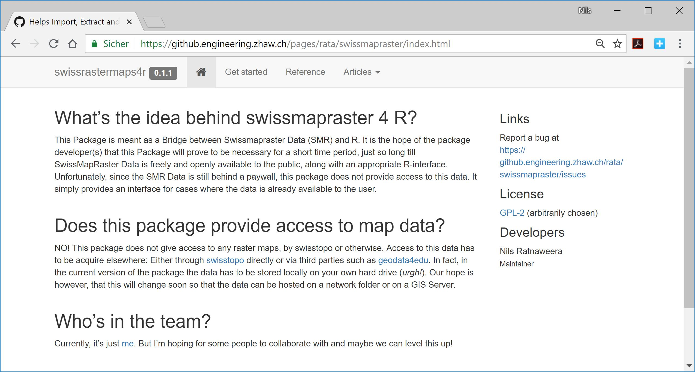

```{r setup, include=FALSE}
options(htmltools.dir.version = FALSE)
knitr::opts_chunk$set(warning = F,message = F)
```


```{r, include=F}

library(tmap,quietly = T)
library(sf,quietly = T)
library(raster,quietly = T)

library(swissboundriesR)

data("landesgebiet")

library(tidyverse)
```

## What's this about?

--

I want to simplify access to swisstopo geodata from within `R`. 

Currently, using swisstopo rastermaps in `R` is easy if: 

--

- the map only incldes _one single_ file  

--

- you know exactly where to find that file

--

**BUT:** 

- Smaller scale maps are split into multiple tiles. 
- For example, the 1:25'000 map consists of 260 individual Tiles


```{r,include=F}
tmap_mode("plot")

switzerland<- raster::brick("C:/Users/rata/Geodata/01_Switzerland/01_Maps/PK_1000_2056_relief/1mio_relief.tif")
raster::crs(switzerland) <- sp::CRS("+init=EPSG:2056")

library(swissrastermaps4r)
```


```{r,include=F}
data("gemeinden_top_poly")
zuerich <- gemeinden_top_poly[gemeinden_top_poly$NAME == "Zürich",]
```

---

## Current workflow


--

1. first decide on a scale

--

2. search for the relevant map number(s)

--

3. find the appropriate raster map(s) based on the map numbers

--

4. import raster data into R

--

5. check resolutions and possibly resample all rasters to same resolution

--

6. merge all the relevant raster maps into a single file

--

7. possibly reassign CRS and colormap

--

8. finally: plot data

--

→ This is where `swissrastermaps4r` comes in.

→ This `R` package (work in progress) automates steps 2 - 7

---

## swissrastermaps4r


```{r}
{{library(swissrastermaps4r)}}

```

--

```{r}
fdir_init("C:/Users/rata/Geodata/01_Switzerland/01_Maps")
```

--

```{r}
{{zuerich_raster <- get_raster(zuerich,scale_level = 100,method = "bbox")}}
```


---

## swissrastermaps4r
```{r}
{{tm_shape(zuerich_raster)}} + 
  tm_rgb() +
  tm_shape(zuerich,is.master = T) + 
  tm_borders(col = "red",lwd = 3)
```


---
## Want to join?


```{r,eval=F}
if(
  any(
    c(
      "you use swiss raster maps in R",
      "you want to learn package development",
      "you have connections to swisstopo and/or geodata4edu",
      "you have too much spare time"
    )
  )
){
  contact(who = "Nils Ratnaweera",how = "rata@zhaw") else{
    go_to("Apero")
  }
}
```


<!-- I'm looking for people to join this venture. If -->

<!-- -- -->

<!-- - you use swiss raster maps in `R`  _and / or_ -->

<!-- -- -->

<!-- - you want to learn package development _and / or_ -->

<!-- -- -->

<!-- - you have connections to **swisstopo** and/or **geodata4edu** _and / or_ -->

<!-- -- -->

<!-- - you have too much spare time 😄 -->

<!-- -- -->


<!-- ### Contact me! -->

<!-- **rata@zhaw.ch** -->

---

## We're on Github! 

[https://github.engineering.zhaw.ch/rata/swissmapraster](https://github.engineering.zhaw.ch/rata/swissmapraster)



(Openly accessible on the **ZHAW** github, is easily moved to github.com)

**rata@zhaw.ch**
